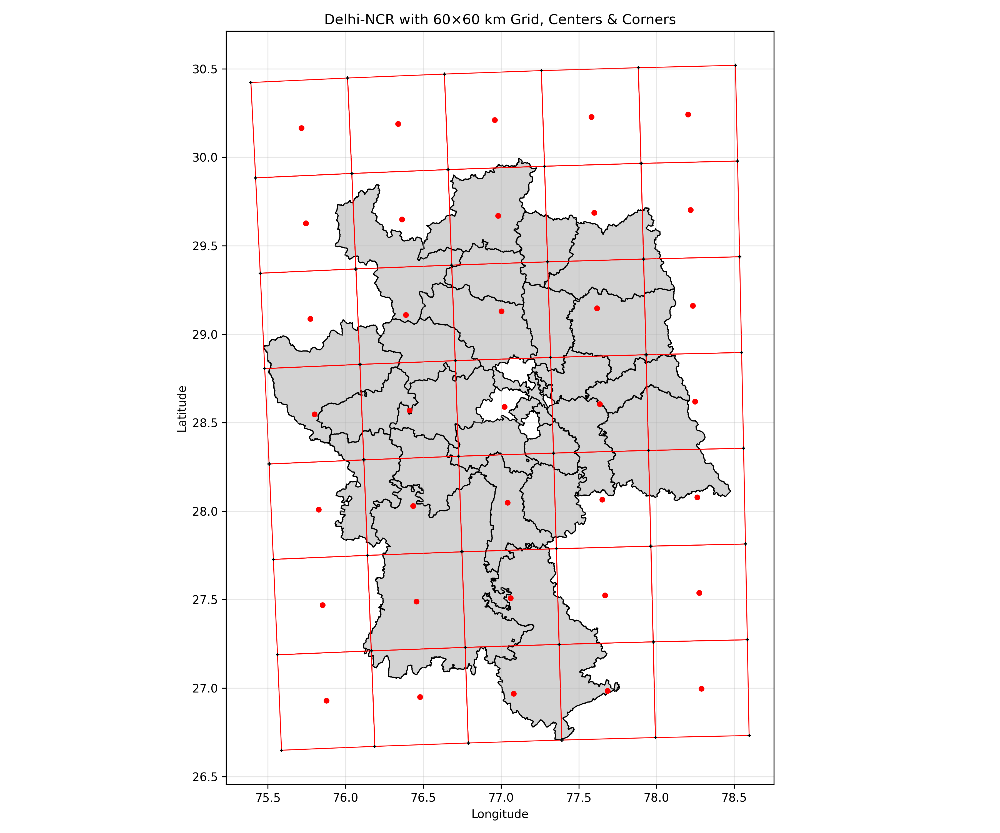
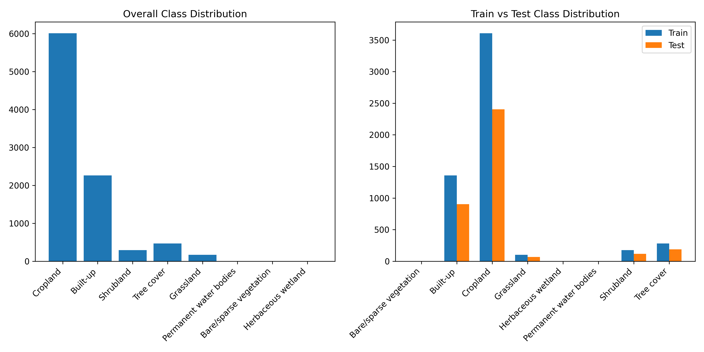
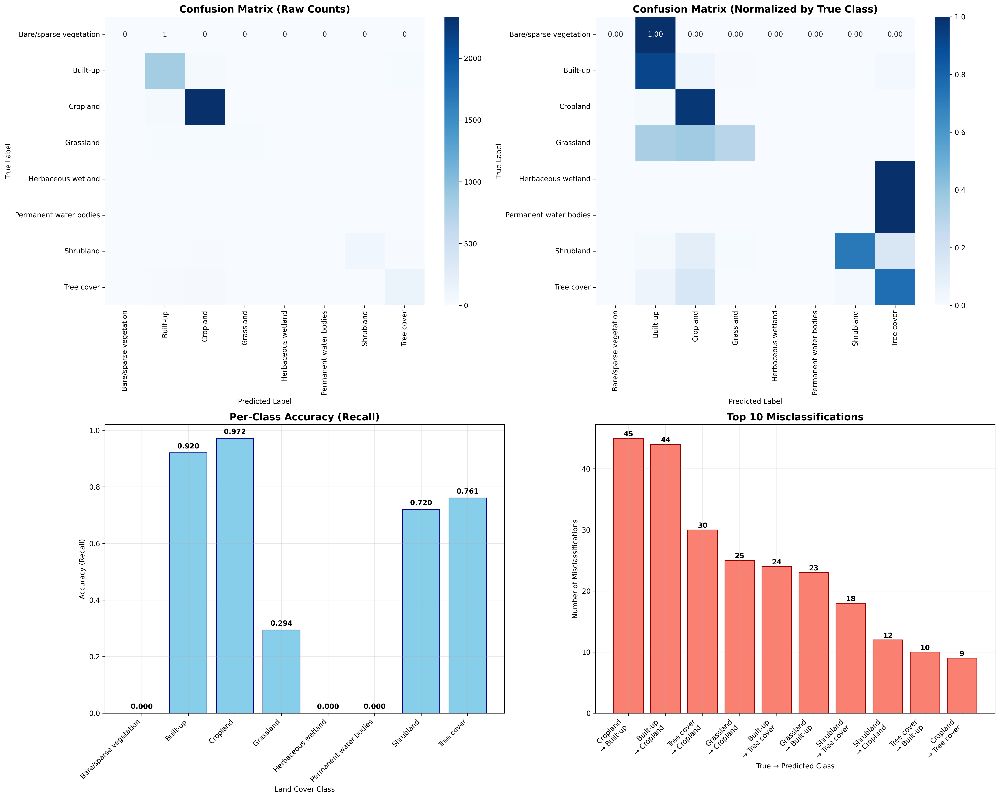
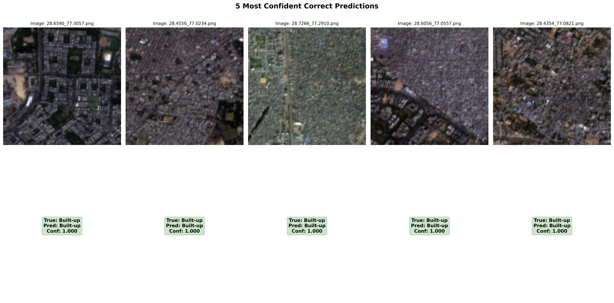
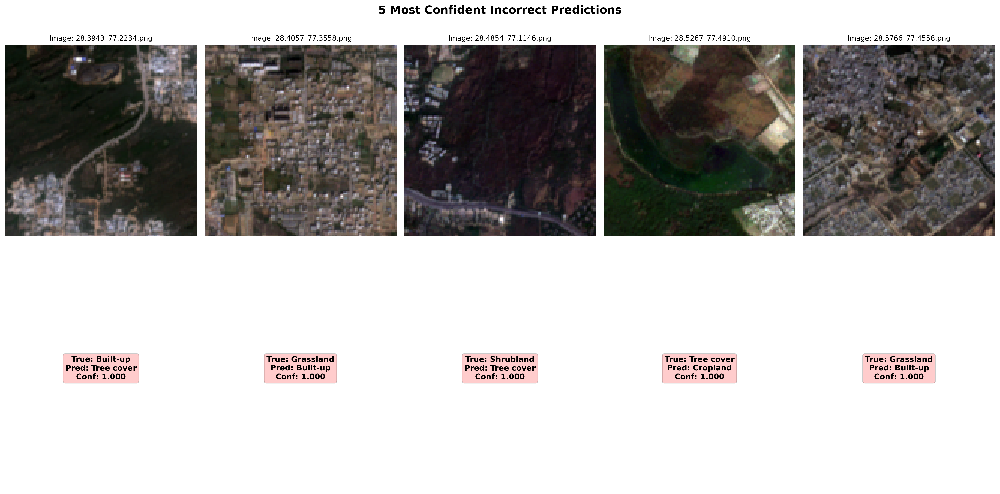
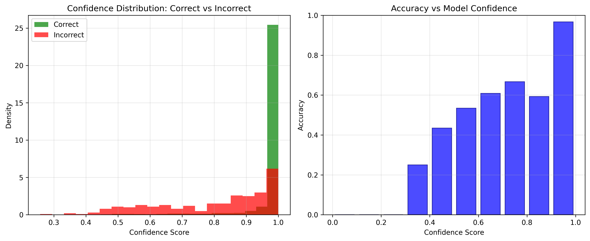

# Earth Observation: Delhi Air Quality Analysis using AI

## Overview
The Ministry of Environment has commissioned an AI-based audit of the Delhi Airshed to identify land use patterns and pollution sources using satellite imagery and geospatial analysis. This project implements spatial reasoning, machine learning, and computer vision techniques to analyze land cover patterns in the Delhi-NCR region.

## Dataset
The project utilizes the following datasets:

1. **Delhi-NCR Region Shapefile** (EPSG:4326) - `delhi_ncr_region.geojson`
2. **Sentinel-2 RGB Image Patches** - 128×128 pixels, 10m/pixel resolution
   - Located in `data/rgb/` directory
   - Filenames mapped to center coordinates (latitude_longitude.png format)
3. **Delhi-Airshed Shapefile** (EPSG:4326) - `delhi_airshed.geojson`
4. **ESA WorldCover 2021 Land Cover Raster** (10m resolution) - `worldcover_bbox_delhi_ncr_2021.tif`

## Project Structure
```
earth-observation-delhi-air/
├── data/
│   ├── delhi_ncr_region.geojson
│   ├── delhi_airshed.geojson
│   ├── worldcover_bbox_delhi_ncr_2021.tif
│   └── rgb/                          # Sentinel-2 RGB patches
├── scripts/
│   ├── grid.ipynb                    # Main analysis notebook
│   ├── q1_grid_plot.png             # Grid visualization
│   ├── q2_class_distribution.png    # Class distribution plots
│   ├── confusion_matrix_analysis.png# Confusion matrix visualization
│   ├── correct_predictions.png      # Correct prediction examples
│   ├── incorrect_predictions.png    # Incorrect prediction analysis
│   ├── confidence_analysis.png      # Model confidence analysis
│   └── filtered_images.csv         # Filtered image coordinates
├── output/                          # Analysis outputs
└── README.md
```

## Tasks and Analysis

### Question 1: Spatial Reasoning & Data Filtering

#### Q1.1: Grid Visualization with Matplotlib
- **Task**: Plot Delhi-NCR shapefile and overlay 60×60 km grid
- **Output**: `scripts/q1_grid_plot.png`
- **Implementation**: Created spatial grid using UTM projection (EPSG:32644) and overlaid on Delhi-NCR boundaries



#### Q1.2: Interactive Satellite Basemap
- **Task**: Overlay grid on satellite basemap using leafmap
- **Implementation**: Interactive map with satellite imagery, grid overlay, and regional boundaries
- **Features**: Clickable grid cells with center points and corner markers

#### Q1.3: Grid Cell Analysis
- **Task**: Mark four corners and center of each grid cell
- **Implementation**: Computed grid centroids and corner coordinates
- **Result**: 60×60 km grid cells with precise geometric marking

#### Q1.4: Spatial Filtering
- **Task**: Filter satellite images based on coordinates falling within grid
- **Implementation**: Spatial join operation using GeoPandas
- **Process**: 
  - Parse filename coordinates (lat_lon.png format)
  - Create point geometries for image centers
  - Filter using "within" spatial predicate

#### Q1.5: Data Summary
- **Task**: Count and report images before/after filtering
- **Output**: `scripts/filtered_images.csv`
- **Results**: Statistical summary of spatial filtering effectiveness

### Question 2: Machine Learning Classification

#### Data Preparation
- **Land Cover Labeling**: Extract dominant land cover class for each image patch using ESA WorldCover
- **Class Mapping**: 11 standardized ESA land cover classes:
  - Tree cover, Shrubland, Grassland, Cropland, Built-up
  - Bare/sparse vegetation, Snow and ice, Permanent water bodies
  - Herbaceous wetland, Mangroves, Moss and lichen

#### Class Distribution Analysis
- **Output**: `scripts/q2_class_distribution.png`
- **Analysis**: Train/test split with stratified sampling (60/40 split)
- **Visualization**: Bar charts showing class frequencies and distribution balance



#### CNN Model Training
- **Architecture**: ResNet18 (pre-trained on ImageNet)
- **Modification**: Final layer adapted for land cover classes
- **Training Configuration**:
  - Optimizer: Adam (lr=1e-4)
  - Loss: CrossEntropyLoss
  - Epochs: 5
  - Batch size: 32
  - Data augmentation: ImageNet normalization

#### Model Evaluation

##### Custom F1 Score Implementation
- **Metrics**: Macro, Micro, and Weighted F1 scores
- **Per-class Analysis**: Precision, Recall, F1-score, and Support for each land cover type
- **Validation**: Comparison with sklearn and torchmetrics implementations

##### Confusion Matrix Analysis
- **Output**: `scripts/confusion_matrix_analysis.png`
- **Features**:
  - Raw counts and normalized confusion matrices
  - Per-class accuracy visualization
  - Top misclassification patterns
  - Class imbalance analysis



##### Prediction Analysis
- **Correct Predictions**: `scripts/correct_predictions.png`
- **Incorrect Predictions**: `scripts/incorrect_predictions.png`
- **Confidence Analysis**: `scripts/confidence_analysis.png`

**Visual Analysis Features**:
- 5 most confident correct predictions with satellite images
- 5 most confident incorrect predictions for error analysis
- Confidence distribution analysis (correct vs incorrect)
- Model calibration assessment





## Technical Implementation

### Key Technologies
- **Geospatial**: GeoPandas, Rasterio, Shapely
- **Machine Learning**: PyTorch, torchvision, scikit-learn
- **Visualization**: Matplotlib, Seaborn, Leafmap
- **Data Processing**: Pandas, NumPy

### Edge Case Handling
- **No-data pixels**: Filtered out zero values in land cover raster
- **Incomplete patches**: Skipped edge cases with insufficient 128×128 coverage
- **Mixed class dominance**: Used majority voting for dominant land cover class
- **Spatial boundaries**: Proper coordinate system transformations (WGS84 ↔ UTM)

### Model Performance Metrics
- **Multi-class F1 scores**: Macro, Micro, Weighted averages
- **Confusion matrix analysis**: Class-wise performance breakdown
- **Confidence calibration**: Relationship between prediction confidence and accuracy
- **Visual validation**: Sample-based prediction verification

## Key Findings

1. **Spatial Distribution**: Successfully mapped satellite imagery to geographic grid system
2. **Land Cover Patterns**: Identified dominant land cover types across Delhi-NCR region
3. **Model Performance**: CNN classifier achieved effective land cover classification
4. **Error Analysis**: Systematic identification of challenging class pairs and edge cases
5. **Validation**: Multiple metrics confirm model reliability and proper implementation

## Usage

1. **Setup Environment**: Install required packages (see imports in notebook)
2. **Data Preparation**: Ensure all datasets are in `data/` directory
3. **Run Analysis**: Execute `scripts/grid.ipynb` notebook sequentially
4. **Review Outputs**: Check generated visualizations and analysis files

## Results Summary

The project successfully demonstrates:
- Effective spatial analysis and filtering of satellite imagery
- Robust CNN-based land cover classification
- Comprehensive model evaluation and validation
- Visual interpretation of model predictions and limitations
- Scalable framework for environmental monitoring using AI

This analysis provides the Ministry of Environment with actionable insights for monitoring land use patterns and identifying potential pollution sources in the Delhi-NCR region through automated satellite imagery analysis.